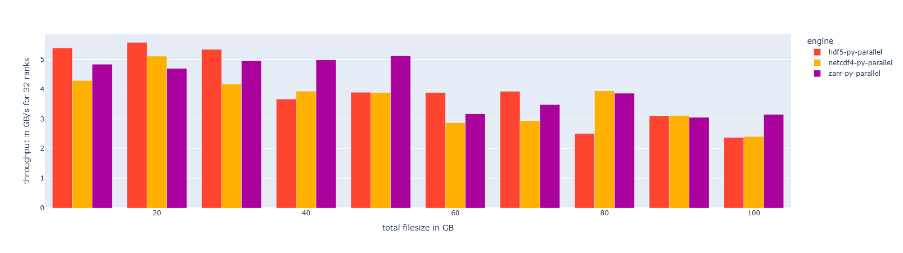

# HPFFbench

## Introduction

Requires: `python >= 3.14` and some form of `git` present, either through direct install or a `module` file

HPFFbench stands for {H}igh-{P}erformance {F}ile {F}ormat {bench}mark. (Name is debatable)

It was developed for the [DKRZ](https://www.dkrz.de/en) to evaluate the performance of different file format used in [High-Performance Computing (HPC)](https://www.nvidia.com/en-us/glossary/high-performance-computing/) like [NetCDF4](https://www.unidata.ucar.edu/software/netcdf), [HDF5](https://www.hdfgroup.org/solutions/hdf5/) & [Zarr](https://zarr.dev/) throughout various language-interfaces.

The main goal was to analyze performance across different cluster environments running [slurm](https://slurm.schedmd.com/overview.html), configured with different runtime variables and produce reliable, reproducible results showcasing influences and potential opportunities for optimization. It launches each phase, i.e. `creating` a file & `executing` some function of that file for testing, as a separate, new `node-allocation` within a `slurm` cluster to potentially reduce caching effects by only using fresh nodes for benchmarking.

This first major contribution aims to be a starting-point for future development and establish a baseline concept for how such a benchmark-framework could potentially look like.

| Languages | Supported |
| ------------- | ------------- |
| Python | &check; |
| C | &check; |
| Rust | planned |

## Examples

## Installation

The project comes bundled with an initial interface to the [spack](https://spack.io/) package manager often used in HPC and is designed to manage requested package versions for you. However due to spacks quirkiness it is advised to source the spack environment and install packages yourself. This is to ensure dependencies are grouped as required. Spack requires `bzip2 ca-certificates g++ gcc gfortran git gzip lsb-release patch python3 tar unzip xz-utils zstd` to be installed.

The `HPFFbench-setup.sh` script should install spack and setup a local python virtual environment `.venv` with necessary packages for you.

For initial installation simply run `./HPFFbench-setup.sh`.

Afterwards `source .venv/bin/activate` as the final step.

Everything else should be taken care of by the framework.

### Additional

If you require specific spack packages to be dependencies of one another it is advised you install these packages yourself as spack can be quirky.

For this purpose source the `. spack/share/spack/setup-env.sh` script which should have been installed and install the required packages.
